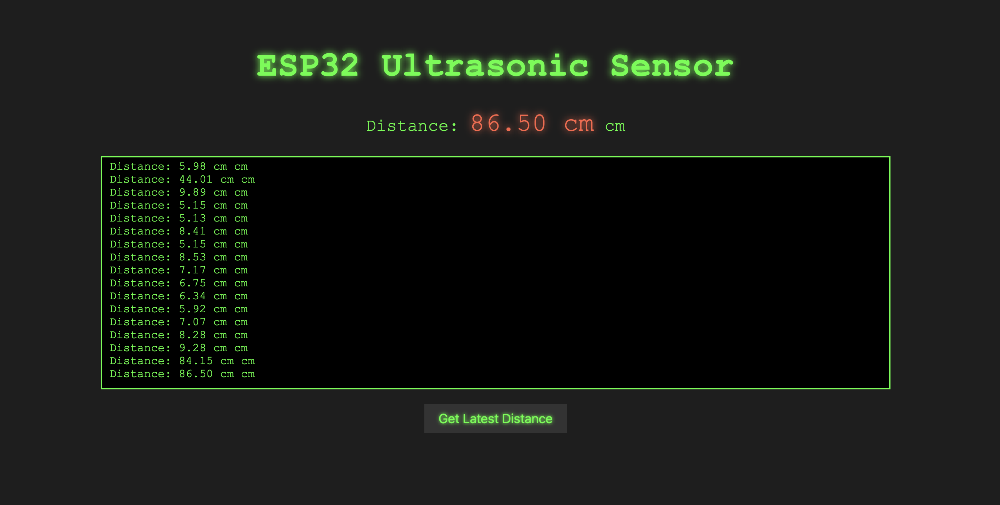

<<<<<<< HEAD
# ESP32_SENSOR_WEB_PAGE
=======
# ESP32-Ultrasonic-Distance-Sensor-Web-Interface

!!!ADD ESP_IDF ALL LIBS to MakeLists.txt 

---

### **Overview:**

This project enables real-time distance measurement using an ultrasonic sensor (HC-SR04) and displays the measured distance on a webpage. The ESP32 microcontroller reads the data from the ultrasonic sensor and hosts an HTTP server, which serves the data to a web interface.

---

### **Key Features:**

- **Distance Measurement**: Using an ultrasonic sensor (HC-SR04) connected to the ESP32.
- **Real-time Data**: Distance data is displayed in real-time on the web page.
- **Web Interface**: A hacker-style dark theme web interface that updates every second.
- **Terminal-like Logging**: Logs sensor data in a "terminal" style on the webpage.
- **Manual Refresh**: A button for fetching the latest data at any time.

---

### **Hardware Requirements:**

1. **ESP32 Development Board**
2. **HC-SR04 Ultrasonic Distance Sensor**
   - Trigger pin (TRIG) connected to GPIO 25 on ESP32.
   - Echo pin (ECHO) connected to GPIO 33 on ESP32.
3. **Wires and Breadboard** (for connecting components)

---

### **Software Requirements:**

1. **ESP-IDF** (Espressif IoT Development Framework)
   - The main framework for programming the ESP32.
2. **Web Browser** (for accessing the webpage)
3. **Code Editor** (e.g., Visual Studio Code, with ESP-IDF plugin)

---

### **Steps to Implement the Project:**

#### **Step 1: Hardware Setup**

1. **Connect the Ultrasonic Sensor to the ESP32:**
   - **VCC** of HC-SR04 to **5V** (or 3.3V depending on the model).
   - **GND** of HC-SR04 to **GND** of the ESP32.
   - **TRIG** pin of HC-SR04 to **GPIO 25** on ESP32.
   - **ECHO** pin of HC-SR04 to **GPIO 33** on ESP32.

2. **Ensure that your ESP32 is connected to your computer** for programming.

---

#### **Step 2: Software Setup**

1. **Install ESP-IDF:**
   - Follow the official [ESP-IDF installation guide](https://docs.espressif.com/projects/esp-idf/en/latest/get-started/) to set up the development environment for your ESP32.

2. **Create a New ESP-IDF Project:**
   - In your ESP-IDF environment, create a new project (e.g., `esp32-ultrasonic-web`).
   - Add the necessary components (FreeRTOS, HTTP Server, Wi-Fi, etc.).

---

#### **Step 3: Writing the Code**

1. **Configure Wi-Fi:**
   - Connect the ESP32 to a Wi-Fi network by providing the network SSID and password in the code.

2. **Ultrasonic Sensor Code:**
   - Write the code to initialize the ultrasonic sensor and measure the distance.
   - Use GPIO pins to trigger the sensor and receive the echo pulse, then calculate the distance.

3. **Web Server Code:**
   - Set up an HTTP server on the ESP32 to serve distance data.
   - Create an HTTP endpoint `/distance` that will return the measured distance when accessed.

4. **Front-End (HTML + JavaScript):**
   - Create a simple webpage with a terminal-style interface to display the distance.
   - Use JavaScript’s `fetch` API to pull the latest distance data from the ESP32's web server every second.

---

#### **Step 4: Deploy the Code**

1. **Flash the Code to the ESP32:**
   - Use the ESP-IDF’s flashing tools (e.g., `idf.py flash`) to load the code onto your ESP32.

2. **Access the Web Interface:**
   - Open the browser and access the ESP32’s IP address on port 80 (e.g., `http://<ESP32_IP>/distance`) to see the real-time distance data.

---

#### **Step 5: Web Interface (Hacker Style)**

- The web interface will display the measured distance in a "hacker-style" dark theme, with the data updated every second. 
- It includes a **manual refresh** button and a **logging terminal** for showing real-time sensor readings.

---

### **Code Explanation:**

1. **Wi-Fi Setup:**
   - The ESP32 connects to the specified Wi-Fi network using the `wifi_config` structure. It checks for the IP address once connected.

2. **Distance Measurement:**
   - The `measure_distance_cm()` function sends a pulse to the TRIG pin and listens to the ECHO pin to calculate the travel time. This time is used to calculate the distance.

3. **HTTP Server Setup:**
   - The `distance_handler` function handles requests to the `/distance` endpoint and returns the measured distance as a string in the HTTP response.

4. **JavaScript Frontend:**
   - A JavaScript function (`fetchDistance`) fetches the latest distance from the ESP32 and updates the displayed distance every second. It also logs the data to the "terminal" section for real-time updates.

---

### **Step 6: Testing and Debugging**

1. **Test the System:**
   - After flashing the code to the ESP32, connect it to the Wi-Fi network and open the webpage in your browser.
   - Ensure that the distance data updates every second.

2. **Debugging:**
   - Check the console logs if something is not working correctly.
   - Use the ESP32’s debug logs to monitor Wi-Fi connectivity and sensor behavior.

---

### **Future Enhancements:**

1. **Multiple Sensors Support:**
   - Add support for multiple ultrasonic sensors to measure distances in different directions.
   
2. **Data Logging:**
   - Implement functionality to log the distance data to an external database (e.g., MySQL, Firebase).

3. **User Authentication:**
   - Add password protection for the web interface to restrict access.

4. **Mobile-Friendly Design:**
   - Make the frontend responsive for mobile devices for better usability.

---

### **Conclusion:**

This project successfully demonstrates how to use an ESP32 to interface with an ultrasonic sensor, read distance measurements, and display the data in real-time on a web page with a hacker-style theme. The ESP32's ability to host a web server and serve data to a browser makes it a powerful tool for IoT applications.
>>>>>>> 3779f9e (Initial commit)
